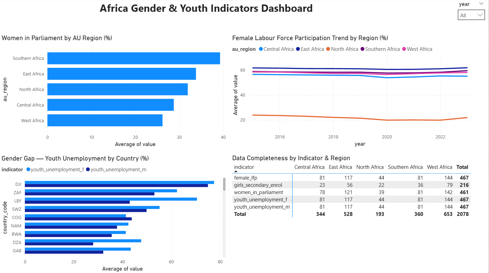

# Africa Gender & Youth Data Project

> M&E data analysis and reporting project for Africa gender & youth indicators | SQL · Python · Power BI 

[](https://www.python.org/)
[](https://www.postgresql.org/)
[](https://powerbi.microsoft.com/)
[](LICENSE)

---

## Overview

This project is an end-to-end **Monitoring, Evaluation & Learning (MEL)** data pipeline built to track gender and youth indicators across African countries.

It demonstrates how raw survey and administrative data can be cleaned, stored in a relational database, queried with SQL, and visualised in Power BI to generate actionable insights for development programmes.

---

## Why This Project Exists

Development organisations working on gender equity and youth empowerment in Africa face a recurring challenge: data exists in silos; different formats, different countries, different years. This makes it hard to track progress against indicators like:

- Female labour force participation rate
- Youth unemployment (ages 15-35)
- Girls secondary school enrolment
- Women in decision-making positions

This tracker solves that by building a reproducible, auditable pipeline from raw data to a dashboard.

---

## Tools and Technologies

| Tool | Purpose |
|------|---------|
| Python (pandas, SQLAlchemy) | Data cleaning and loading |
| PostgreSQL | Structured storage and SQL analysis |
| Jupyter Notebooks | Reproducible analysis documentation |
| Power BI | Interactive dashboard and reporting |
| GitHub | Version control|

---

## Project Structure

```
africa-gender-youth-data-tracker/
|
|-- data/
|   |-- raw/           # Original CSV files (downloaded from the World Bank Open Data API)
|   |-- cleaned/       # Processed, analysis-ready datasets
|
|-- notebooks/
|   |-- 01_data_cleaning.ipynb      # Data ingestion, cleaning, standardisation
|   |-- 02_sql_analysis.ipynb       # SQL queries via Python (SQLAlchemy + psycopg2)
|   |-- 03_reporting_export.ipynb   # Summary tables and export for Power BI
|
|-- dashboard/
|   |-- 04_gender_youth_dashboard.pbix    # Power BI file
|   |-- dashboard_screenshot.png    # Dashboard preview
|
|-- README.md
```

---

## Data Sources (Simulated)

The datasets used in this project were sourced from the World Bank Open Data API for all 54 African Union member states:

- `gender_indicators.csv` — Female labour force participation, women in parliament, literacy rates by country and year
- `youth_employment.csv` — Youth unemployment rates by gender, NEET rates, vocational training enrolment
- `education_access.csv` — School enrolment by gender (primary, secondary, tertiary)


---

## Notebooks

### Notebook 01. Data Cleaning

What it does:
- Loads raw CSV files into pandas DataFrames
- Standardises column names, country codes, and year formats
- Handles missing values using forward-fill and regional median imputation
- Exports cleaned files to `data/cleaned/`

Key skills demonstrated: pandas, data quality checks, MEL data standardisation

---

### Notebook 02. SQL Analysis

What it does:
- Loads cleaned data into a local PostgreSQL database using SQLAlchemy
- Runs 6 analytical SQL queries covering:
  1. Average female labour force participation by region
  2. Top 10 countries by gender parity improvement (2015-2023)
  3. Youth unemployment trends: East vs West Africa
  4. Countries below the AU 30% women-in-parliament target
  5. Combined gender and youth risk index (UNION query)
  6. Year-on-year change in girls' secondary enrolment

Key skills demonstrated: PostgreSQL, window functions, UNION queries, aggregation, subqueries

---

### Notebook 03. Reporting and Export

What it does:
- Generates summary DataFrames from SQL query results
- Exports final indicator tables to CSV for Power BI ingestion
- Produces a structured indicator summary report

Key skills demonstrated: Data export pipeline, reporting automation, M&E indicator formatting

---

## Power BI Dashboard



The dashboard contains 4 key visuals:

| Visual | Description |
|--------|-------------|
| Women in Parliament by AU Region | Bar chart - average % of women in parliament per region |
| Female Labour Force Participation Trend | Line chart - FLP rate over time (2015-2023) by region |
| Gender Gap - Youth Unemployment by Country | Clustered bar - male vs female youth unemployment per country |
| Data Completeness by Indicator and Region | Matrix table - record counts per indicator per region |

Slicer: Year (2015-2023) - filters all visuals by reporting year.

---

## Key Findings

- **Southern Africa** leads on women in parliament (~38%), while West Africa is lowest (~27%)
- **North Africa** is a clear outlier on female labour force participation (~22% vs continental average of ~58%)
- **DJI (Djibouti) and LBY (Libya)** show the largest male-female youth unemployment gap
- Data completeness is **100% balanced**, 477 records per indicator across all regions

---

## How to Run This Project

### Prerequisites

```bash
pip install pandas sqlalchemy psycopg2-binary openpyxl jupyter
```

Create a PostgreSQL database called `gender_tracker`:

```sql
CREATE DATABASE gender_tracker;
```

### Steps

1. Clone this repository:

```bash
git clone https://github.com/TeresiahNjoroge/africa-gender-youth-data-tracker.git
cd africa-gender-youth-data-tracker
```

2. Run notebooks in order:

```
notebooks/01_data_cleaning.ipynb
notebooks/02_sql_analysis.ipynb
notebooks/03_reporting_export.ipynb
```

3. Open Power BI Desktop and load CSVs from `data/cleaned/`

---

## Alignment to AU WGYD Framework

| AU Priority Area | Indicator Tracked |
|-----------------|-------------------|
| Economic Empowerment | Female labour force participation rate |
| Political Participation | Women in national parliaments (%) |
| Education and Skills | Girls secondary school enrolment |
| Youth Employment | Youth unemployment rate (ages 15-35) |
| Integrated Reporting | Gender and Youth combined data completeness |

---

## About the Author

**Teresiah Njoroge** — Data Analyst | Nairobi, Kenya

Experienced in SQL, Python, and Power BI with a background in operations, project management, and data-driven reporting. Passionate about using data to drive evidence-based decisions in development, climate, and gender equity programmes.

- LinkedIn: [linkedin.com/in/teresiah-njoroge](https://linkedin.com/in/teresiah-njoroge)
- GitHub: [github.com/TeresiahNjoroge](https://github.com/TeresiahNjoroge)

---

## License

MIT License — see [LICENSE](LICENSE) for details.
